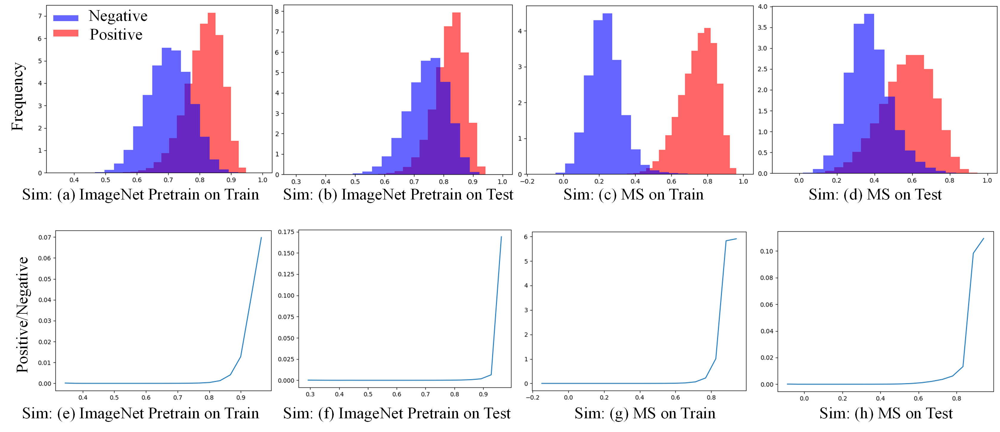
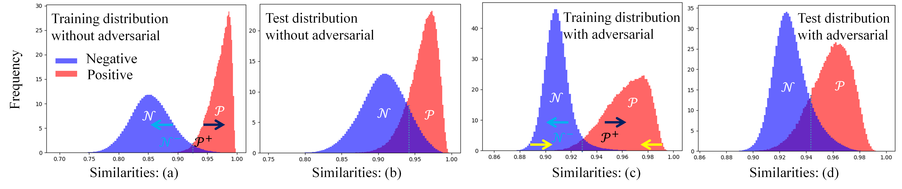

# Deep Bayesian Metric Learning (DBML)

This code is mainly for the TPAMI submitted paper [Deep Bayesian Metric Learning with Similarity Distribution Constraints](.). Beyound for this purpose, we will continue to maintain this project and provide tools for metric learning research. Mainly integrate various loss functions and backbones to facilitate academic reseach progress.
 

 

### Abstract
Recent methods for deep metric learning has been focusing on designing different constrastive loss functions between positive and negative pairs of samples so that the learned feature embedding is able to pull positive samples of the same class closer and push negative samples from different classes away from each other. Instead of exploring different heuristic loss functions, in this work, we propose to develop a better theoretical understanding of the metric learning process based on Bayesian analysis of probability distributions of positive and negative samples. This results in a new systematic loss function to guide the learning of the feature embedding network. Our extensive experimental results and ablation studies on benchmark datasets demonstrate that our new method is able to significantly improve the deep metric learning performance.

### Performance compared with SOTA methods on CUB-200-2011 for 512 dimensional embeddings
* BN-Inception Backbone

|Recall@K | 1 | 2 | 4 | 8 |
 |:---  |:-:|:-:|:-:|:-:|
|Ranked List (H) | 57.4 | 69.7 | 79.2 | 86.9 |
|Ranked List (L,M,H) | 61.3 | 72.7 | 82.7 | 89.4 |
|SoftTriple | 65.4 | 76.4 | 84.5 | 90.4 |
|DeML | 65.4 | 75.3 | 83.7 | 89.5 |
|MS | 65.7| 77.0| 86.3| 91.2|
|Contrastive+HORDE |66.8 |77.4 |85.1 |91.0 |
|**Ours DBML-BN-Inception**| **69.5** |**79.4** |**87.0** |**92.4** |

* ResNet50 Backbone

|Recall@K | 1 | 2 | 4 | 8 |
 |:---  |:-:|:-:|:-:|:-:|
|Devide-Conquer| 65.9| 76.6| 84.4| 90.6|
|MIC+Margin| 66.1| 76.8| 85.6| -|
|TML| 62.5| 73.9| 83.0| 89.4|
|**Ours DBML-ResNet50**|**69.9** |**80.4** |**87.2**|**92.5** |

### Performance compared with SOTA methods on CUB-200-2011 for 64 dimensional embeddings
* ResNet50 Backbone

|Recall@K | 1 | 2 | 4 | 8 |
 |:---  |:-:|:-:|:-:|:-:|
 |N-Pair| 53.2 | 65.3| 76.0 | 84.8|
 |ProxyNCA| 55.5 | 67.7 | 78.2 | 86.2 |
 |EPSHN| 57.3| 68.9| 79.3| 87.2|
 |MS| 57.4| 69.8| 80.0| 87.8|
 |***Ours DBML-ResNet50***|**64.3**|**75.7**|**84.1**|**90.1**|
 
 * ResNet18 Backbone
 
 |Recall@K | 1 | 2 | 4 | 8 |
 |:---  |:-:|:-:|:-:|:-:|
 |N-Pair|52.4|65.7|76.8|84.6|
 |ProxyNCA|51.5|63.8|74.6|84.0|
 |EPSHN|54.2|66.6|77.4|86.0|
 |***Ours DBML-ResNet18***|**61.3**|**72.6**|**81.9**|**88.7**|
 
 * GoogleNet Backbone
 
 |Recall@K | 1 | 2 | 4 | 8 |
 |:---  |:-:|:-:|:-:|:-:|
 |Triplet|42.6|55.0|66.4|77.2|
 |N-Pair|45.4|58.4|69.5|79.5|
 |ProxyNCA|49.2|61.9|67.9|72.4|
 |EPSHN|51.7|64.1|75.3|83.9|
 |***Ours DBML-GoogleNet***|**59.3**|**70.7**|**80.6**|**88.1**|

### Prepare the data and the pretrained model 

The following script will prepare the [CUB](http://www.vision.caltech.edu.s3-us-west-2.amazonaws.com/visipedia-data/CUB-200-2011/CUB_200_2011.tgz) dataset for training by downloading to the ./resource/datasets/ folder; which will then build the data list (train.txt test.txt):

```bash
./scripts/prepare_cub.sh
```

Download the imagenet pretrained model of 
[googlenet](https://download.pytorch.org/models/googlenet-1378be20.pth), [bninception](http://data.lip6.fr/cadene/pretrainedmodels/bn_inception-52deb4733.pth) and [resnet50](https://download.pytorch.org/models/resnet50-19c8e357.pth), and put them in the folder:  ~/.cache/torch/checkpoints/.


### Installation

```bash
sudo pip3 install -r requirements.txt
sudo python3 setup.py develop build
```
###  Train and Test on CUB-200-2011 with DBML-Loss based on BN-Inception backbone

```bash
./scripts/run_cub_bninception.sh
```
Trained models will be saved in the ./output-bninception-cub/ folder if using the default config.

Best recall@1 higher than 69 (69.5 in the paper).

###  Train and Test on CUB-200-2011 with DBML-Loss based on ResNet50 backbone

```bash
./scripts/run_cub_resnet50.sh
```
Trained models will be saved in the ./output-resnet50-cub/ folder if using the default config.

Best recall@1 higher than 69.5 (69.9 in the paper).

###  Train and Test on CUB-200-2011 with DBML-Loss based on GoogleNet backbone

```bash
./scripts/run_cub_googlenet.sh
```
Trained models will be saved in the ./output-googlenet-cub/ folder if using the default config.

Best recall@1 higher than 64.0 (63.8 in the paper).

### Citation

If you use this method or this code in your research, please cite as:

    @inproceedings{TPAMI-Shichao-2020,
    title={Deep Bayesian Metric Learning with Similarity Distribution Constraints},
    author={Shichao Kan, Yigang Cen, Yang Li, Zhihai He},
    booktitle={},
    pages={},
    year={2020}
    }

### Acknowledgments
This code is written based on the framework of [MS-Loss](https://github.com/MalongTech/research-ms-loss), we are really grateful to the authors of the MS paper to release their code for academic research / non-commercial use. In this work, [Shichao Kan](https://kanshichao.github.io) proposed the method and wrote the code and conducted experiments, Zhihai He provided the experimental environment, wrote the manuscript, participated discussion and helped to improve the rigorous of the method. Yigang Cen is the PhD advisor of Shichao Kan, and provided part of the finical support on this work and participated the discussion and proof reading. Yang Li also participated the discussion and proof reading.

### License
This code is released for academic research / non-commercial use only. If you wish to use for commercial purposes, please contact [Shichao Kan](https://kanshichao.github.io) by email kanshichao10281078@126.com.

### Recommended Papers About Metric Learning
* Michael Opitz, Georg Waltner, Horst Possegger, Horst Bischof: [Deep Metric Learning with BIER: Boosting Independent Embeddings Robustly.](https://arxiv.org/abs/1801.04815) IEEE Trans. Pattern Anal. Mach. Intell. 42(2): 276-290 (2020)
* Junnan Li, Pan Zhou, Caiming Xiong, Richard Socher, Steven C. H. Hoi: [Prototypical Contrastive Learning of Unsupervised Representations.](https://arxiv.org/abs/2005.04966) arXiv abs/2005.04966 (2020)
